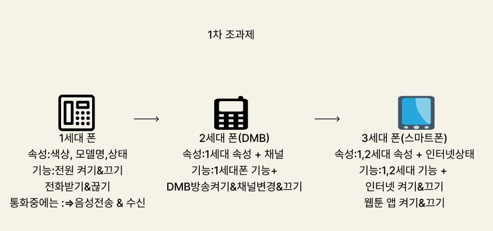

제출 기한:~6/10

목적 : 공부   
(인터넷 구글링 등을 통해서 완성을 하는게 목표가 아니라 미완성으로 제출하더라도 모든 조원들이 한줄이상 공부가 되었으면 성공)
   
   
진행 방법:   
  **-1.조별로 인원을 반 또는 자유롭게 나눈다.**   
  **-2.각 세대별 폰을 Class로 각각 구현한다.**   
  **-3.구현 된 Class들을 하나의 Class인 SuperPhone으로 합쳐서 사용 가능하게 한다.**   
  **-4.반드시 각각의 부분을 나눠서 합쳐야 한다.**   
  (나중에 협업 과정에서 필요한 부분이며 메소드의 이름이나 필드 등의 어느정도의 네이밍룰은 만들고 진행)**   
 **-5.모든 메소드 이름이나 구현 방법은 자유롭게 한다.**   
  
부가설명:   
  **-1. 모든 클래스는 생성 시 모든 속성을 입력 받아야만 생성 가능하다.**   
  **-2. 모든 기능과 속성의 데이터타입은 아래 설명에 따라 만든다.**   
  
  
  * * *  
  * * *  
  
  
  1세대폰 기능 설명
  -
    -기능1: 전원 켜기 & 끄기 : return 이 없는 기능으로 단순하게 전원이 켜고 꺼지며 , 상태 정보가 변경 된다
        (ex . 전원 켜기 : 상태 ( 전원 켜짐 ) , 전원 끄기 ( 전원 꺼짐 )
        
    -기능2: 전화 받기 & 끊기 : 객체의 전원 상태 정보가 켜짐이고 전화중이 아닌경우에 전화 받기가 가능하며 
                             전화를 받게 되면 상태 정보는 전화중으로 변경 된다.
                             객체의 상태 정보가 전화중인 경우 전화 끊기가 가능하다.
                           
    -기능3: 음성 전송 & 수신 : 전화중 상태에서만 음성 전송 및 수신이 가능하며 문자열을 입력하여 음성을 전송하고 문자열을
                            입력하여 수신 받는것으로 인식한다.
                           
   
   2세대폰 기능 설명
   -
   (기본적으로 모든 1세대의 기능을 가지고 있으며 DMB기능이 추가 된 2세대 폰)
   
    -기능1: 상태정보가 전원이 켜져있는 상태에서만 DMB방송을 켜는 기능이며 상태정보가 DMB 시청중으로 변경 된다.
              (전화중 x , 종료상태x)
   
    -기능2: 채널변경&끄기 상태정보가 DMB시청중일때만 가능하며 채널데이터를 숫자로 입력받아 채널을 변경하고 기존 
            채널과 변경 된 채널을 콘솔창에 출력한다.
   
   3세대폰 기능 설명
   -
   (기본적으로 1,2세대의 모든 기능을 가지고 있으며 인터넷 기능이 추가 된 3세대 폰)
   
    -기능1: 상태정보가 전원이 켜져있는 상태에서 인터넷 사용이 가능하며 인터넷 사용 시 상태정보가 인터넷 
           켜짐으로 변경 된다.( 종료상태에서만 사용 불가)
    -기능2: 웹툰 앱 켜기 & 끄기 인터넷 사용상태에서만 실행 가능한 기능
    

 
 ==============출력 예시(콘솔) =====================
 -
   + 콘솔 출력부분
    +   
      + 설명

  + 1세대 폰 ( 색상:검정 , 모델명:이니셜-1 , 상태:종료) 가 지급 되었습니다.
    + (-1세대 폰 생성 시 반드시 상태정보가 출력 된다.)
     
  + 이니셜-1 전원이 켜졌습니다.   
    + (-1세대폰 모든 기능을 점검합니다.)
    
  + 이니셜-1 전원이 꺼졌습니다. 
  + 전원이 꺼져있어 전화 받기가 불가 합니다.             
  + 전원이 꺼져있어 전화 끊기가 불가 합니다.           
  + 통화중이 상태가 아닙니다. 음성 전송 & 수신이 불가 합니다.        
 
  + 이니셜-1 전원이 켜졌습니다.
  + 전화가 와서 전화를 받았습니다.
  + 나: 여보세요?
  + 상대방:여보세요?
  + 전화를 끊습니다.
 
 
------------출력 예시(콘솔)------------
 -
 
 2세대 폰 ( 색상:검정 , 모델명:이니셜-2, 상태:종료  채널:정보없음 ) 가 지급 되었습니다. (1세대 폰 모든 기능을 점검)
 
+ 전원이 꺼져있어 DMB방송을 켤수가없습니다. 
+ 이니셜-2가 켜졌습니다.
+ DMB방송을 켭니다 : 현재 채널 : 정보없음 
+ DMB방송의 채널을 변경합니다 : 정보없음=>10번으로 변경 됨.
+ DMB방송을 끕니다.
 
 
------------출력 예시(콘솔)------------
 -
 
 3세대 폰 ( 색상:검정 , 모델명:이니셜-3, 상태:종료  채널:정보없음 ) 가 지급 되었습니다. (1,2세대 폰 모든 기능을 점검)
 
 + 전원이 꺼져있어 DMB방송을 켤수가없습니다. 
 + 전원이 꺼져있어 인터넷 사용이 불가능 합니다.
 + 전원을 켭니다.
 + 전화를 받습니다.
 + 나:여보세요?
 + 인터넷을 켭니다.
 + 웹툰 앱을 켭니다.
 + 상대방:뭐하세요?
 + 나:웹툰 봅니다.
 + 전화를 끊습니다.
 
 
 
 
 
 
 
 
 

 
 
  
